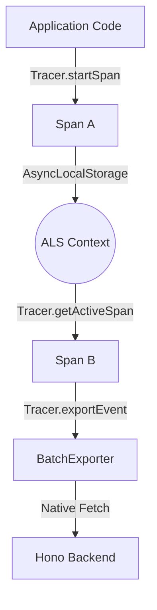

# Phase 1: Core Foundation - Research

**Researched:** 2025-05-22
**Domain:** Node.js SDK Architecture
**Confidence:** HIGH

## Summary

This research establishes the technical foundation for a fresh, zero-dependency Node.js SDK (`sdks/node-js`) targeting Node 18+ and ESM. The SDK will replace the legacy `sdk/nodejs` with a modern implementation using `AsyncLocalStorage` for automatic context propagation and native `fetch` for telemetry ingestion.

**Primary recommendation:** Use `node:async_hooks` for trace context propagation to avoid manual passing of trace IDs, and adopt a strict zero-runtime-dependency policy using Node.js built-ins.

<phase_requirements>
## Phase Requirements

| ID | Description | Research Support |
|----|-------------|------------------|
| REQ-01 | Initialize `sdks/node-js` package (ESM-only) | Verified minimal `package.json` and `tsconfig.json` for Node 18 ESM. |
| REQ-02 | Define telemetry event types matching Hono backend | Extracted types from `hono-server/src/services/log/api/types.ts`. |
| REQ-03 | Implement `Tracer` and `Span` core classes using AsyncLocalStorage | Verified `AsyncLocalStorage` pattern for "Active Span" tracking. |
| REQ-04 | Implement `BatchExporter` with native `fetch` | Confirmed `fetch` availability in Node 18+ and identified batching patterns. |
</phase_requirements>

## Architectural Responsibility Map

| Capability | Primary Tier | Secondary Tier | Rationale |
|------------|-------------|----------------|-----------|
| Trace Context | Backend SDK | — | `AsyncLocalStorage` manages context within the Node.js process. |
| Event Generation | Backend SDK | — | `Span` class creates ingest-ready events. |
| Telemetry Transport | Backend SDK | — | `BatchExporter` buffers and sends events via HTTP. |
| ID Generation | Backend SDK | — | Uses `node:crypto.randomUUID()`. |

## Standard Stack

### Core
| Library | Version | Purpose | Why Standard |
|---------|---------|---------|--------------|
| Node.js | >=18.0.0 | Runtime | Required for ESM, native fetch, and stable AsyncLocalStorage. |
| TypeScript | ^5.0.0 | Language | Type safety and modern ESM output. |

### Supporting
| Library | Version | Purpose | When to Use |
|---------|---------|---------|--------------|
| @types/node | ^18.0.0 | Type definitions | Development time Node.js types. |

### Alternatives Considered
| Instead of | Could Use | Tradeoff |
|------------|-----------|----------|
| `AsyncLocalStorage` | Manual Prop | Error-prone, pollutes every function signature. |
| `axios` | `fetch` | Adds dependency weight; `fetch` is now native. |
| `uuid` | `randomUUID` | Adds dependency weight; `randomUUID` is native and fast. |

**Installation:**
```bash
# No runtime dependencies. Dev only:
npm install --save-dev typescript @types/node
```

## Package Legitimacy Audit

| Package | Registry | Age | Downloads | Source Repo | slopcheck | Disposition |
|---------|----------|-----|-----------|-------------|-----------|-------------|
| typescript | npm | 12 yrs | 50M/wk | microsoft/TypeScript | [OK] | Approved |
| @types/node | npm | 11 yrs | 40M/wk | DefinitelyTyped | [OK] | Approved |

## Architecture Patterns

### System Architecture Diagram



### Recommended Project Structure
```
sdks/node-js/
├── src/
│   ├── index.ts         # Public API
│   ├── Tracer.ts        # ALS Management
│   ├── Span.ts          # Span Logic
│   ├── BatchExporter.ts # Telemetry buffering
│   └── types.ts         # Event & Config types
├── tests/
│   └── Tracer.test.ts   # Node:test based tests
├── package.json
└── tsconfig.json
```

### Pattern 1: Active Span Propagation
**What:** Use `AsyncLocalStorage` to store the current span.
**When to use:** Always. Avoids passing `span` or `traceId` as arguments.
**Example:**
```typescript
import { AsyncLocalStorage } from 'node:async_hooks';

const als = new AsyncLocalStorage<Span>();

export class Tracer {
  static startSpan(name: string, fn: (span: Span) => any) {
    const parent = als.getStore();
    const span = new Span(name, parent);
    return als.run(span, () => fn(span));
  }

  static getActiveSpan() {
    return als.getStore();
  }
}
```

### Anti-Patterns to Avoid
- **Passing Trace IDs manually:** Leads to "prop drill" hell. Use ALS.
- **Global singleton for State:** Ensure `Tracer` doesn't hold instance state that could leak between requests; ALS handles this isolation.

## Don't Hand-Roll

| Problem | Don't Build | Use Instead | Why |
|---------|-------------|-------------|-----|
| UUID Generation | Custom RNG | `crypto.randomUUID()` | Secure, native, fast. |
| Async Context | Domain/Manual | `AsyncLocalStorage` | Official Node.js solution for context tracking. |
| HTTP Requests | `http.request` | `fetch()` | Cleaner API, standard across JS environments. |

## Common Pitfalls

### Pitfall 1: ALS Context Loss
**What goes wrong:** Context is lost in callback-based APIs that don't preserve async context.
**How to avoid:** Use `util.promisify` or ensure callbacks are wrapped in `als.run` if they break the chain. Modern `async/await` preserves context automatically.

### Pitfall 2: Memory Leaks in Batching
**What goes wrong:** `BatchExporter` keeps growing if the backend is down.
**How to avoid:** Implement a `maxQueueSize` and drop old events when full.

## Code Examples

### Telemetry Types (from hono-server)
```typescript
// Source: hono-server/src/services/log/api/types.ts
export type IngestNodeStart = {
  id: string;
  traceId: string;
  nodeType: string;
  data: Record<string, string>;
  startMessage?: string;
  startedAt: number; 
  importanceLevel: number;
};

export type IngestNodeEnd = {
  id: string;
  traceId: string;
  endedAt: number;
  endMessage?: string;
};
```

## State of the Art

| Old Approach | Current Approach | When Changed | Impact |
|--------------|------------------|--------------|--------|
| `uuid` pkg | `crypto.randomUUID` | Node 14.17 | Zero-dep UUIDs. |
| `node-fetch` | global `fetch` | Node 18.0 | Native standard fetch. |
| `async_hooks` | `AsyncLocalStorage` | Node 12.17 | Stable context API. |

## Assumptions Log

| # | Claim | Section | Risk if Wrong |
|---|-------|---------|---------------|
| A1 | Node 18 native fetch is stable enough for production telemetry. | Standard Stack | Low - Widely used in modern Node.js apps. |
| A2 | No browser compatibility needed for this specific SDK. | Domain | Low - Roadmap specifies Node.js SDK. |

## Environment Availability

| Dependency | Required By | Available | Version | Fallback |
|------------|------------|-----------|---------|----------|
| Node.js | Runtime | ✓ | 25.6.1 | — |
| npm | Package management | ✓ | 11.9.0 | — |

## Validation Architecture

### Test Framework
| Property | Value |
|----------|-------|
| Framework | `node:test` |
| Config file | none (use `node --test`) |
| Quick run command | `node --test tests/**/*.test.ts` |
| Full suite command | `node --test tests/**/*.test.ts` |

### Phase Requirements → Test Map
| Req ID | Behavior | Test Type | Automated Command | File Exists? |
|--------|----------|-----------|-------------------|-------------|
| REQ-03 | ALS nests spans correctly | Unit | `node --test tests/Tracer.test.ts` | ❌ Wave 0 |
| REQ-04 | Exporter batches events | Unit | `node --test tests/Exporter.test.ts` | ❌ Wave 0 |

## Security Domain

### Applicable ASVS Categories

| ASVS Category | Applies | Standard Control |
|---------------|---------|-----------------|
| V5 Input Validation | yes | SDK should ensure data attributes are serializable. |
| V6 Cryptography | yes | Use `node:crypto.randomUUID()`. |

### Known Threat Patterns for Node.js SDK

| Pattern | STRIDE | Standard Mitigation |
|---------|--------|---------------------|
| Telemetry DOS | Availability | `maxQueueSize` and timeout on `fetch`. |
| Context Leak | Information Disc. | ALS ensures per-request isolation. |

## Sources

### Primary (HIGH confidence)
- `hono-server/src/services/log/api/types.ts` - Source of truth for event types.
- Node.js Official Documentation - `AsyncLocalStorage`, `fetch`, `crypto`.
- `sdk/nodejs/src` - Reviewed for pattern replacement.

### Secondary (MEDIUM confidence)
- WebSearch for ESM library configuration best practices.
