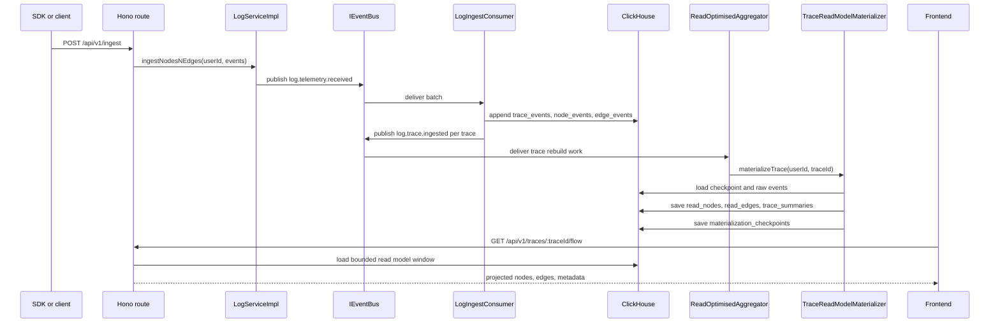

# 1.1. System Overview

Topo-Tracer is a graph-based tracing backend for high-volume execution traces. It is optimized for backend workflows where the interesting question is not only "how long did a span take?" but "what graph of work happened, what can I hide safely, and how do I inspect a large trace without loading all of it?"

The active backend is `hono-server`. It runs as a Hono app through Wrangler and can also be served by Bun through `src/bun.ts`.

## Core Architecture Benefits

- **Explicit graph model:** Edges are first-class telemetry events. The backend never infers graph links from node ids, names, start order, or ancestry paths.
- **Append-first write path:** Raw trace facts are stored as immutable ClickHouse rows before read models are rebuilt.
- **Read-optimized materialization:** Expensive event folding, topological ordering, diagnostics, and clock-skew correction happen asynchronously.
- **Bounded reads:** Trace list, summary, and flow endpoints enforce limits so a single request cannot load a whole massive trace.
- **Importance thresholding:** A node is visible when `importanceLevel <= threshold`; hidden runs become ghost nodes instead of disappearing.
- **Operational separation:** HTTP, service orchestration, repositories, event bus implementations, storage schemas, and projection logic are separate modules.

## Major Components

| Component | Responsibility | Main files |
| --- | --- | --- |
| Hono app | Routes, middleware, startup bootstrapping, graceful shutdown | `hono-server/src/index.ts`, `hono-server/src/bun.ts` |
| Auth service | Signup, OTP, login, JWT validation, API keys | `hono-server/src/services/auth` |
| Log service | Ingestion validation, event publishing, trace reads, deletion | `hono-server/src/services/log/internal/service-impl/LogServiceImpl.ts` |
| Raw write repo | Converts ingest batches into ClickHouse raw rows | `hono-server/src/services/log/internal/repo/impl/LogWriteRepoClickHouse.ts` |
| Read repo | Loads checkpoints/raw events/read models and saves projections | `hono-server/src/services/log/internal/repo/impl/LogReadRepoClickHouse.ts` |
| Ingest consumer | Consumes `log.telemetry.received`, writes raw events, emits trace rebuild signals | `hono-server/src/services/log/internal/worker/LogIngestConsumer.ts` |
| Read-model aggregator | Coalesces and bounds concurrent materialization per trace | `hono-server/src/services/log/internal/worker/ReadOptimisedAggregator.ts` |
| Materializer | Folds raw events into latest nodes, edges, summaries, diagnostics, checkpoints | `hono-server/src/services/log/internal/materialization/TraceReadModelMaterializer.ts` |
| Projector | Converts materialized graph state into threshold-filtered UI windows | `hono-server/src/services/log/internal/projection/LogFlowProjector.ts` |
| Event bus | Batch event contract with dev and Kafka implementations | `hono-server/src/infra/event-bus` |
| Storage | Postgres for auth/outbox; ClickHouse for telemetry raw/read data | `hono-server/src/infra/db` |
| Node SDK | Emits trace, node, edge, and log-node events | `sdks/node-js/src` |
| Frontend | Lists traces and renders flow projections with React Flow | `frontend/src` |

## Data Flow

## Runtime State

The backend keeps a small amount of process-local state:

- ClickHouse and Postgres client singletons in `src/infra/db`.
- Event bus handlers and idempotency cache for the dev bus.
- Kafka producer/consumer connections when `EVENT_BUS_TYPE=kafka`.
- Outbox relay polling state.
- In-flight trace materialization queues in `ReadOptimisedAggregator`.
- AsyncLocalStorage request trace context in `InternalTracer`.

Durable application state lives in:

- Postgres: users, pending signups, OTPs, API keys, and outbox rows.
- ClickHouse: raw telemetry events, read models, summaries, realtime summary aggregates, and checkpoints.

## Important Invariants

- Raw telemetry is append-only.
- Graph structure comes only from edge events.
- Materialization progress resumes from `materialization_checkpoints`.
- Save read models before saving checkpoints.
- Never serve a full trace graph without caps.
- Treat event-bus delivery as at-least-once; consumers must be idempotent.
- Filter visibility by `importanceLevel <= threshold`.
- Use `argMax(..., materialized_at_ms)` when reading latest rows from `ReplacingMergeTree` tables.
