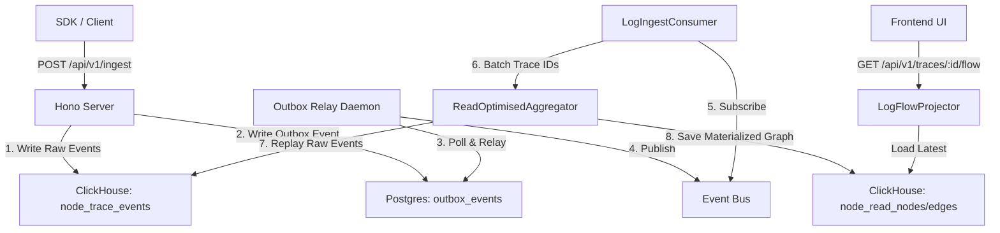

# System Overview

Topo-Tracer is a high-performance trace ingestion and graph projection backend powered by **Hono** running on Cloudflare Workers (or Bun locally). 

Unlike traditional hierarchical tracing systems, Topo-Tracer stores a primitive graph where **edges are explicit causal links** between **nodes**. The backend does not infer graph shape from span nesting or parent IDs.

## Core Components

The backend is built around a rigorous service-and-repository architecture, separating HTTP routes, business logic, persistence, and event processing.

1.  **Hono Server (`src/index.ts`)**: The HTTP boundary. It provides REST APIs for trace ingestion, trace reading, and user authentication.
2.  **Postgres (Primary Application DB)**: Stores users, sessions, API keys, OTPs, and serves as the durable backing store for the transactional Outbox.
3.  **ClickHouse (Telemetry DB)**: The append-only source of truth for raw trace events, and the materialized read-model engine (via `ReplacingMergeTree`) for fast graph projections.
4.  **Event Bus & Outbox Relay**: An at-least-once message delivery system. Ingestion writes raw events to ClickHouse and outbox records to Postgres in one request. A background daemon then relays outbox records onto the Event Bus (Kafka/InMemory).
5.  **Materialization Engine (`ReadOptimisedAggregator`)**: Listens to `trace.events.ingested` topics, reads raw events from ClickHouse, and computes the latest `ReadNode` and `ReadEdge` states, writing them back to ClickHouse.

## Directory Layout

-   `common/`: Shared primitives like loggers and environment bindings.
-   `infra/`: Infrastructure adapters (Auth middleware, ClickHouse clients, Postgres clients, Event Bus, Outbox).
-   `services/`: Pure business logic with strict internal repositories.
    -   `auth`: User registration, JWT issuance, API keys.
    -   `log`: Trace ingestion, event materialization, graph projection.
    -   `external-notification`: Hooks for emails or alerts.

## High-Level Data Flow

