# Master Specification: Topo-Tracer V4 (Unified Span Model & Dynamic View Levels)

This document serves as the master technical blueprint and design philosophy for **Topo-Tracer V4**. It defines the unified telemetry model, the key-value attributes namespace standard, the ClickHouse CQRS schema, the Node.js SDK auto-nesting APIs, and the frontend layout rendering engine.

---

## 1. Executive Summary & Design Philosophy

Topo-Tracer V3 successfully solved "The Wall of Spaghetti" by introducing tag-based CQRS snapping and nested container boundaries. However, its rigid architectural division between **Containers** (infrastructure) and **Nodes** (execution) introduced several limitations:
1.  **Duplicate Stack Logic:** Nodes and containers required separate tables, routes, SDK classes, and visual layout handlers.
2.  **Rigid Visual Nesting:** Shared infrastructure spans (like Kafka queues, Redis, or PostgreSQL) that were called deep inside nested execution trees got buried visually, making the system architecture hard to audit.
3.  **Flat Metadata:** Simple string array tags (`tags: string[]`) prevented high-powered key-value querying or tag inheritance.

### The V4 Core Philosophy: The Unified Span Model
Topo-Tracer V4 unifies service boundaries and execution spans into a single, high-performance primitive: the **Span**.

```mermaid
flowchart TD
    subgraph V3 [Old V3 Rigid Separated Model]
        C[Container] -->|Has Node| N[Node]
        C -->|Parentage| C_Parent[Parent Container]
    end

    subgraph V4 [New V4 Unified Span Model]
        S1[Span: kind=boundary] -->|Parentage| S2[Span: kind=execution]
        S2 -->|Parentage| S3[Span: kind=execution]
        
        style S1 fill:#1e293b,stroke:#3b82f6,stroke-width:2px;
        style S2 fill:#0f172a,stroke:#8b5cf6,stroke-width:2px;
        style S3 fill:#0f172a,stroke:#8b5cf6,stroke-width:2px;
    end
```



#### Key Architecture Tenets in V4:
1.  **Unified Scope Primitives (`Span`):**
    Everything is a `Span` with a `parentId`. The rendering behavior is governed by `kind`:
    *   **`boundary` (formerly Container):** Represents process, microservice, pod, or logical boundaries. Renders as nested wrapping cards.
    *   **`execution` (formerly Node):** Represents a chronological block of execution (e.g. function call, DB query). Renders as node cards or rows.
2.  **Explicit `view_level` (Visual Columns):**
    Instead of calculating vertical/horizontal columns recursively at runtime using heavy graph algorithms, every span carries a materialized **`view_level`** integer. 
    *   *Auto-Increment:* The SDK automatically sets `viewLevel = parent.viewLevel + 1` for normal execution nesting.
    *   *Manual Hoisting:* Developers can override this (e.g. `viewLevel: 0`), pulling deep nested infrastructure spans (like Kafka) out to the root level of the canvas instantly.
3.  **Key-Value Attributes (`attributes Map(String, String)`):**
    Tags are upgraded from a flat string list to dynamic key-value attributes with namespace conventions (`sys.*`, `http.*`, `db.*`).
4.  **Zero-Overhead Materialization & CQRS:**
    Nesting paths (`parentage`) and sequence metrics are materialized asynchronously, allowing the read path to serve lightweight payloads with zero runtime graph-ranking overhead.

---

## 2. Telemetry Schema & CQRS Storage (ClickHouse)

The columnar schema collapses from 6 split tables in V3 to 3 unified tables in V4.

```mermaid
flowchart TD
    subgraph Ingestion [1. Telemetry Ingestion (Node.js SDK)]
        A[span.startBoundary] -->|started| B[raw_spans]
        C[span.startSpan] -->|started| B
        D[span.end] -->|ended| B
    end

    subgraph ClickHouse [2. Materialization Worker (CQRS)]
        B -->|debounced compile| W[TraceMaterializationWorker]
        W -->|Batch Materialize| R_Spans[read_spans]
        W -->|Pre-compute distance| R_Edges[read_edges]
    end

    subgraph UI [3. High-Fidelity Rendering]
        R_Spans -->|SQL select with view_level <= X| F_Layout[Frontend Layout Engine]
        R_Edges -->|Causal Link Tunneling| F_Layout
        F_Layout -->|Render SVG overlay| Canvas[Glassmorphic Flow Canvas]
    end
```

### 2.1 Write Path: Raw Append-Only Ingestion Logs
The ingestion endpoints perform rapid writes into a single, append-only columnar log table.

#### `toco_tracer.raw_spans`
```sql
CREATE TABLE IF NOT EXISTS toco_tracer.raw_spans (
  id String,
  trace_id String,
  parent_id String,                  -- Points to parent Span ID (nullable)
  name String,
  kind Enum8('boundary' = 1, 'execution' = 2),
  type String,                       -- e.g., 'service', 'database', 'queue', 'function'
  tags Map(String, String),          -- High-powered key-value attributes
  event_type Enum8('started' = 1, 'ended' = 2),
  timestamp Int64                    -- Millisecond Epoch timestamp
) ENGINE = MergeTree()
ORDER BY (trace_id, timestamp);
```

#### `toco_tracer.raw_edges`
```sql
CREATE TABLE IF NOT EXISTS toco_tracer.raw_edges (
  id String,
  trace_id String,
  from_span_id String,
  to_span_id String,
  type String,                       -- e.g., 'http_request', 'kafka_message'
  timestamp Int64
) ENGINE = MergeTree()
ORDER BY (trace_id, timestamp);
```

---

### 2.2 Read Path: Materialized Topology Structures

#### `toco_tracer.read_spans`
Pre-compiled by the background worker. Storing `view_level` and `parentage` directly in ClickHouse eliminates all runtime column-ranking graph calculations.

```sql
CREATE TABLE IF NOT EXISTS toco_tracer.read_spans (
  id String,
  trace_id String,
  parent_id String,
  name String,
  kind Enum8('boundary' = 1, 'execution' = 2),
  type String,
  tags Map(String, String),
  parentage Array(String),           -- Lineage path of Span IDs: [root_id, ..., current_id]
  view_level UInt16,                 -- Stored visual column index (direct from SDK)
  local_sequence UInt32,             -- Chronological sequence inside parent
  start_time_us Int64,
  duration_us Nullable(Int64),
  metadata String
) ENGINE = MergeTree()
ORDER BY (trace_id, start_time_us);
```

#### `toco_tracer.read_edges`
```sql
CREATE TABLE IF NOT EXISTS toco_tracer.read_edges (
  id String,
  trace_id String,
  from_span_id String,
  to_span_id String,
  type String,
  distance Int32,                    -- Hop distance between chronological spans
  metadata String
) ENGINE = MergeTree()
ORDER BY (trace_id, id);
```

---

## 3. Node.js SDK Telemetry API

The Node.js SDK exposes a single unified `Span` class, automating nested hierarchy construction while providing simple overrides for dynamic hoisting.

### 3.1 SDK Interface Spec
```typescript
export interface SpanConfig {
  type?: string;
  tags?: Record<string, string>;
  viewLevel?: number; // Explicit override to hoist/pull out spans
}

export class Span {
  public id: string;
  public traceId: string;
  public parentId: string | null;
  public name: string;
  public kind: "boundary" | "execution";
  public viewLevel: number;
  private isFinished = false;

  constructor(opts: {
    id?: string;
    traceId: string;
    parentId?: string | null;
    name: string;
    kind: "boundary" | "execution";
    viewLevel?: number;
    type?: string;
    tags?: Record<string, string>;
  }) {
    this.id = opts.id || uuidv4();
    this.traceId = opts.traceId;
    this.parentId = opts.parentId || null;
    this.name = opts.name;
    this.kind = opts.kind;
    
    // Default: Root is 0, children auto-increment in startSpan/startBoundary
    this.viewLevel = opts.viewLevel !== undefined ? opts.viewLevel : 0;

    Tracer.exportSpanEvent({
      id: this.id,
      traceId: this.traceId,
      parentId: this.parentId,
      name: this.name,
      kind: this.kind,
      type: opts.type || (this.kind === "boundary" ? "module" : "function"),
      tags: opts.tags || {},
      viewLevel: this.viewLevel,
      eventType: "started",
      timestamp: Date.now(),
    });
  }

  /**
   * Starts a nested execution span (Node card).
   * Auto-assigns parent.viewLevel + 1.
   */
  public startSpan(name: string, config?: SpanConfig): Span {
    return new Span({
      traceId: this.traceId,
      parentId: this.id,
      name,
      kind: "execution",
      viewLevel: config?.viewLevel !== undefined ? config.viewLevel : this.viewLevel + 1,
      type: config?.type,
      tags: config?.tags,
    });
  }

  /**
   * Starts a nested boundary span (Container card).
   * Auto-assigns parent.viewLevel + 1.
   */
  public startBoundary(name: string, config?: SpanConfig): Span {
    return new Span({
      traceId: this.traceId,
      parentId: this.id,
      name,
      kind: "boundary",
      viewLevel: config?.viewLevel !== undefined ? config.viewLevel : this.viewLevel + 1,
      type: config?.type,
      tags: config?.tags,
    });
  }

  /**
   * Logs a connection edge from the current span to a target span.
   */
  public logEdge(toSpanId: string, edgeType?: string) {
    Tracer.exportEdge({
      id: uuidv4(),
      traceId: this.traceId,
      fromSpanId: this.id,
      toSpanId,
      type: edgeType || "flow",
      timestamp: Date.now(),
    });
  }

  public end() {
    if (this.isFinished) return;
    this.isFinished = true;
    Tracer.exportSpanEvent({
      id: this.id,
      traceId: this.traceId,
      parentId: this.parentId,
      name: this.name,
      kind: this.kind,
      eventType: "ended",
      timestamp: Date.now(),
    });
  }
}
```

### 3.2 Dynamic Context Propagation
When crossing microservice or queue boundaries, the SDK injects standard carrier headers:
*   `x-trace-id`: The global trace ID.
*   `x-parent-span-id`: The active Span ID.
*   `x-view-level`: The current visual view depth, allowing downstream spans to auto-increment or align correctly.

---

## 4. Frontend Layout & Snapping Algorithms

### 4.1 Grid Coordinates based on `viewLevel`
1.  **Horizontal X-Axis Alignment:**
    Instead of calculating ranks, the canvas horizontal columns map directly to the `viewLevel` index:
    $$X_i = \text{CANVAS\_PAD} + (\text{viewLevel} \times \text{COL\_GAP})$$
2.  **Boundary Rendering (Visual Containers):**
    *   Spans with `kind: 'boundary'` are rendered as **bounding boxes**.
    *   Their horizontal left edge aligns with their `viewLevel` column.
    *   Their width is dynamically sized to encapsulate all child spans nested inside them (both boundary and execution).
3.  **Execution Rendering (Visual Nodes):**
    *   Spans with `kind: 'execution'` are rendered as **node cards**.
    *   They are placed inside the boundary box corresponding to their closest ancestor `boundary` span in their `parentage` array.

---

### 4.2 Dynamic AND-Filter Snapping & Snappy Link Tunneling
When users filter the graph by attributes (e.g., `tags['http.status'] = '500'`), some spans become hidden.

1.  **Causal Link Snapping:**
    When drawing an edge from Span $S$ to Span $T$, if $S$ or $T$ is hidden by active filters, we snap the link to preserve connectivity:
    *   **Source Snapping:** Walk backwards through $S$'s `parentage` array:
        $$\text{Lineage}_S = [S_{\text{root}}, \dots, S_{\text{parent}}, S]$$
        Select the closest ancestor ID that is **visible** on the canvas.
    *   **Target Snapping:** Walk backwards through $T$'s `parentage` array:
        $$\text{Lineage}_T = [T_{\text{root}}, \dots, T_{\text{parent}}, T]$$
        Select the closest ancestor ID that is **visible** on the canvas.
    *   **Drawing the Wire:** Draw the cubic Bezier wire connecting these snapped visible nodes.
2.  **Distance Badging:**
    If the link is snapped across hidden spans, we draw a dashed wire with a capsule display of `+{hop_distance} steps` calculated by the materialization worker.

---

## 5. Visual Demonstration: Nested Flow vs. Hoisted Infrastructure

Here is a conceptual trace flow showing the unified model handling both standard nested executions and a hoisted Kafka bus:

```
[COLUMN 0: viewLevel=0]      [COLUMN 1: viewLevel=1]      [COLUMN 2: viewLevel=2]

+---------------------------------------------------------------------------------+
| OrderService (Boundary)                                                         |
|                                                                                 |
|  +---------------------------------------------------------------------------+  |
|  | ProcessCheckout (Execution)                                               |  |
|  |                                                                           |  |
|  |  +---------------------------------------------------------------------+  |  |
|  |  | ValidateInventory (Execution)                                       |  |  |
|  |  +---------------------------------------------------------------------+  |  |
|  |                    | (Direct Solid Wire)                                  |  |
|  |  +---------------------------------------------------------------------+  |  |
|  |  | PublishToKafka (Execution)                                          |====+
|  |  +---------------------------------------------------------------------+  |  |  |
|  +---------------------------------------------------------------------------+  |  |
+---------------------------------------------------------------------------------+  |
                                                                                     |
                                                                                     | (Cross-Column
                                                                                     |  Dashed Wire)
+---------------------------------------------------------+                          |
| Kafka Event Bus (Boundary - Hoisted viewLevel=0!)       | <========================+
|                                                         |
|  +---------------------------------------------------+  |
|  | Topic: order-created (Execution)                  |  |
|  +---------------------------------------------------+  |
+---------------------------------------------------------+
```

---

## 6. Philosophy Standard Attribute Namespaces

To enable standard metrics, dashboards, and automated coloring, Topo-Tracer V4 enforces these namespaces:

| Namespace | Key | Example Value | Description |
| :--- | :--- | :--- | :--- |
| **System** | `sys.env` | `"production"` | Deployment environment |
| | `sys.version` | `"v2.4.1"` | Microservice tag version |
| **HTTP** | `http.method` | `"POST"` | HTTP request method |
| | `http.status_code`| `"201"` | Response code |
| | `http.route` | `"/checkout"` | Target HTTP route |
| **Database**| `db.system` | `"postgresql"` | Database engine |
| | `db.statement` | `"SELECT * FROM orders"` | Executed DB query |
| **Messaging**| `messaging.system`| `"kafka"` | Broker name |
| | `messaging.destination`| `"order-created"`| Topic or Queue name |
