# Master Specification: Topo-Tracer V4 (Unified Span Model & Dynamic View Levels)

This document serves as the master technical blueprint and design philosophy for **Topo-Tracer V4**. It defines the unified telemetry model, the key-value attributes namespace standard, the ClickHouse CQRS schema, the Node.js SDK auto-nesting APIs, and the frontend dynamic view-level layout engine.

---

## 1. Executive Summary & Design Philosophy

Topo-Tracer V3 successfully solved "The Wall of Spaghetti" by introducing tag-based CQRS snapping and nested container boundaries. However, its rigid architectural division between **Containers** (infrastructure) and **Nodes** (execution) introduced several limitations:
1.  **Duplicate Stack Logic:** Nodes and containers required separate tables, routes, SDK classes, and visual layout handlers.
2.  **Rigid Visual Nesting:** Shared infrastructure spans (like Kafka queues, Redis, or PostgreSQL) that were called deep inside nested execution trees got buried visually, making the system architecture hard to audit.
3.  **Flat Metadata:** Simple string array tags (`tags: string[]`) prevented high-powered key-value querying or tag inheritance.

### The V4 Core Philosophy: Unified Spans & Dynamic View Levels
Topo-Tracer V4 unifies service boundaries, execution scopes, and infrastructure hosts into a single, high-performance primitive: the **Span**. Rather than using tags or rigid container types to filter noise, V4 introduces a **dynamic level-of-detail (LOD) zoom engine** controlled entirely by a span's **`view_level`**.

```mermaid
flowchart TD
    subgraph V3 [Old V3 Rigid Separated Model]
        C[Container] -->|Has Node| N[Node]
        C -->|Parentage| C_Parent[Parent Container]
    end

    subgraph V4 [New V4 Unified Span Model]
        S1[Span: kind=boundary, level=0] -->|Parentage| S2[Span: kind=execution, level=1]
        S2 -->|Parentage| S3[Span: kind=execution, level=2]
        
        style S1 fill:#1e293b,stroke:#3b82f6,stroke-width:2px;
        style S2 fill:#0f172a,stroke:#8b5cf6,stroke-width:2px;
        style S3 fill:#0f172a,stroke:#8b5cf6,stroke-width:2px;
    end
```



#### Key Architecture Tenets in V4:
1.  **Unified Scope Primitives (`Span`):**
    Everything is a `Span` with a `parentId`. The rendering behavior is governed by `kind`:
    *   **`boundary` (Container):** Represents process, microservice, pod, or logical boundaries. Renders as nested wrapping cards.
    *   **`execution` (Node):** Represents a chronological block of execution (e.g. function call, DB query). Renders as node cards or rows.
2.  **Explicit `view_level` (Visual Columns):**
    Instead of calculating ranks and columns recursively at runtime using heavy graph algorithms, every span carries a materialized **`view_level`** integer:
    *   *Auto-Increment:* The SDK automatically sets `viewLevel = parent.viewLevel + 1` for normal execution nesting.
    *   *Manual Hoisting:* Developers can override this (e.g. `viewLevel: 0`), pulling deep nested infrastructure spans (like Kafka) out to the root level of the canvas instantly.
3.  **Dynamic Level Naming:**
    Developers can give **optional names** to specific visual levels (e.g., Level 0 = "Architecture Map", Level 1 = "Gateways & Routes"). These are saved in the trace metadata. The UI reads these names to render a custom-branded **Level of Detail (LOD) Zoom Slider** dynamically!
4.  **Pre-Calculated Layout Cache:**
    To achieve sub-millisecond response times, the materialization worker pre-compiles trace coordinates and layouts into a static, optimized JSON structure. When the user changes zoom levels, the frontend **refetches the pre-calculated layout directly from the backend** passing the selected `viewLevel`.
5.  **Ghost Spans (Detail Capsules):**
    When intermediate spans are hidden by the view-level filter, Topo-Tracer does not just hide them silently. It injects a **Ghost Span** along the snapped edge wire containing rich interactive summaries about the hidden operations, including their truncated names, elapsed duration, and timestamps.

---

## 2. Telemetry Schema & CQRS Storage (ClickHouse)

The columnar schema collapses from 6 split tables in V3 to 3 unified tables in V4.

```mermaid
flowchart TD
    subgraph Ingestion [1. Telemetry Ingestion (Node.js SDK)]
        A[span.startBoundary] -->|started| B[raw_spans]
        C[span.startSpan] -->|started| B
        D[span.end] -->|ended| B
    end

    subgraph ClickHouse [2. Materialization Worker (CQRS)]
        B -->|debounced compile| W[TraceMaterializationWorker]
        W -->|Batch Materialize| R_Spans[read_spans]
        W -->|Pre-compute distance| R_Edges[read_edges]
        W -->|Pre-calculate JSON layout| R_Traces[read_traces]
    end

    subgraph UI [3. High-Fidelity Rendering]
        F_Slider[LOD Zoom Slider Changed] -->|GET /telemetry/trace/:id?maxLevel=L| API[LogController]
        API -->|Fetch pre-calculated JSON with level filter L| R_Traces
        API -->|Serve pre-filtered Spans + injected Ghost Spans| Canvas[Glassmorphic Flow Canvas]
    end
```

### 2.1 Write Path: Raw Append-Only Ingestion Logs

#### `toco_tracer.raw_spans`
```sql
CREATE TABLE IF NOT EXISTS toco_tracer.raw_spans (
  id String,
  trace_id String,
  parent_id String,                  -- Points to parent Span ID (nullable)
  name String,
  kind Enum8('boundary' = 1, 'execution' = 2),
  type String,                       -- e.g., 'service', 'database', 'queue', 'function'
  tags Map(String, String),          -- High-powered key-value attributes
  event_type Enum8('started' = 1, 'ended' = 2),
  timestamp Int64,                   -- Millisecond Epoch timestamp
  level_names Map(UInt16, String)    -- Custom visual level names supplied by SDK
) ENGINE = MergeTree()
ORDER BY (trace_id, timestamp);
```

#### `toco_tracer.raw_edges`
```sql
CREATE TABLE IF NOT EXISTS toco_tracer.raw_edges (
  id String,
  trace_id String,
  from_span_id String,
  to_span_id String,
  type String,                       -- e.g., 'http_request', 'kafka_message'
  timestamp Int64
) ENGINE = MergeTree()
ORDER BY (trace_id, timestamp);
```

---

### 2.2 Read Path: Materialized Topology Structures

#### `toco_tracer.read_traces`
Stores aggregated trace metadata, dynamic visual level names, and the fully pre-compiled trace layout JSON.

```sql
CREATE TABLE IF NOT EXISTS toco_tracer.read_traces (
  trace_id String,
  container_ids Array(String),
  tags Array(String),
  level_names Map(UInt16, String),   -- Consolidates all custom visual level names
  layout_json String,                -- Pre-calculated trace layout cache (JSON string)
  created_at Int64
) ENGINE = MergeTree()
ORDER BY (trace_id);
```

#### `toco_tracer.read_spans`
Pre-compiled by the background worker. Storing `view_level` and `parentage` directly in ClickHouse eliminates all runtime column-ranking graph calculations.

```sql
CREATE TABLE IF NOT EXISTS toco_tracer.read_spans (
  id String,
  trace_id String,
  parent_id String,
  name String,
  kind Enum8('boundary' = 1, 'execution' = 2),
  type String,
  tags Map(String, String),
  parentage Array(String),           -- Lineage path of Span IDs: [root_id, ..., current_id]
  view_level UInt16,                 -- Stored visual column index (direct from SDK)
  local_sequence UInt32,             -- Chronological sequence inside parent
  start_time_us Int64,
  duration_us Nullable(Int64),
  metadata String
) ENGINE = MergeTree()
ORDER BY (trace_id, start_time_us);
```

#### `toco_tracer.read_edges`
```sql
CREATE TABLE IF NOT EXISTS toco_tracer.read_edges (
  id String,
  trace_id String,
  from_span_id String,
  to_span_id String,
  type String,
  distance Int32,                    -- Hop distance between chronological spans
  metadata String
) ENGINE = MergeTree()
ORDER BY (trace_id, id);
```

---

## 3. Node.js SDK Telemetry API

The Node.js SDK exposes a single unified `Span` class, automating nested hierarchy construction while providing simple overrides for dynamic hoisting.

### 3.1 SDK Interface Spec
```typescript
export interface SpanConfig {
  type?: string;
  tags?: Record<string, string>;
  viewLevel?: number; // Explicit override to hoist/pull out spans
}

export class Span {
  public id: string;
  public traceId: string;
  public parentId: string | null;
  public name: string;
  public kind: "boundary" | "execution";
  public viewLevel: number;
  private isFinished = false;

  constructor(opts: {
    id?: string;
    traceId: string;
    parentId?: string | null;
    name: string;
    kind: "boundary" | "execution";
    viewLevel?: number;
    type?: string;
    tags?: Record<string, string>;
    levelNames?: Record<number, string>; // Optional level names mapping
  }) {
    this.id = opts.id || uuidv4();
    this.traceId = opts.traceId;
    this.parentId = opts.parentId || null;
    this.name = opts.name;
    this.kind = opts.kind;
    
    // Default: Root is 0, children auto-increment in startSpan/startBoundary
    this.viewLevel = opts.viewLevel !== undefined ? opts.viewLevel : 0;

    Tracer.exportSpanEvent({
      id: this.id,
      traceId: this.traceId,
      parentId: this.parentId,
      name: this.name,
      kind: this.kind,
      type: opts.type || (this.kind === "boundary" ? "module" : "function"),
      tags: opts.tags || {},
      viewLevel: this.viewLevel,
      levelNames: opts.levelNames || {},
      eventType: "started",
      timestamp: Date.now(),
    });
  }

  /**
   * Starts a nested execution span (Node card).
   * Auto-assigns parent.viewLevel + 1.
   */
  public startSpan(name: string, config?: SpanConfig): Span {
    return new Span({
      traceId: this.traceId,
      parentId: this.id,
      name,
      kind: "execution",
      viewLevel: config?.viewLevel !== undefined ? config.viewLevel : this.viewLevel + 1,
      type: config?.type,
      tags: config?.tags,
    });
  }

  /**
   * Starts a nested boundary span (Container card).
   * Auto-assigns parent.viewLevel + 1.
   */
  public startBoundary(name: string, config?: SpanConfig): Span {
    return new Span({
      traceId: this.traceId,
      parentId: this.id,
      name,
      kind: "boundary",
      viewLevel: config?.viewLevel !== undefined ? config.viewLevel : this.viewLevel + 1,
      type: config?.type,
      tags: config?.tags,
    });
  }

  /**
   * Logs a connection edge from the current span to a target span.
   */
  public logEdge(toSpanId: string, edgeType?: string) {
    Tracer.exportEdge({
      id: uuidv4(),
      traceId: this.traceId,
      fromSpanId: this.id,
      toSpanId,
      type: edgeType || "flow",
      timestamp: Date.now(),
    });
  }

  public end() {
    if (this.isFinished) return;
    this.isFinished = true;
    Tracer.exportSpanEvent({
      id: this.id,
      traceId: this.traceId,
      parentId: this.parentId,
      name: this.name,
      kind: this.kind,
      eventType: "ended",
      timestamp: Date.now(),
    });
  }
}
```

### 3.2 Dynamic Context Propagation
When crossing microservice or queue boundaries, the SDK injects standard carrier headers:
*   `x-trace-id`: The global trace ID.
*   `x-parent-span-id`: The active Span ID.
*   `x-view-level`: The current visual view depth, allowing downstream spans to auto-increment or align correctly.

---

## 4. Frontend Layout & Level of Detail (LOD) Snapping

### 4.1 Grid Coordinates based on `viewLevel`
1.  **Horizontal X-Axis Alignment:**
    Instead of calculating ranks, the canvas horizontal columns map directly to the `viewLevel` index:
    $$X_i = \text{CANVAS\_PAD} + (\text{viewLevel} \times \text{COL\_GAP})$$
2.  **Boundary Rendering (Visual Containers):**
    *   Spans with `kind: 'boundary'` are rendered as **bounding boxes**.
    *   Their horizontal left edge aligns with their `viewLevel` column.
    *   Their width is dynamically sized to encapsulate all child spans nested inside them (both boundary and execution).
3.  **Execution Rendering (Visual Nodes):**
    *   Spans with `kind: 'execution'` are rendered as **node cards**.
    *   They are placed inside the boundary box corresponding to their closest ancestor `boundary` span in their `parentage` array.

---

### 4.2 Dynamic Zoom Slider & Snappy Link Tunneling
When users move the Level of Detail slider, the UI filters out noise. Rather than breaking connections, the snapping engine guarantees that wires bridge hidden details to maintain complete topology context.

1.  **Zoom Detail Query:**
    When the slider is set to active detail level $L$:
    *   Spans with `view_level <= L` are rendered as **visible**.
    *   Spans with `view_level > L` are **hidden**.
2.  **Causal Link Snapping:**
    When drawing an edge from Span $S$ to Span $T$, if $S$ or $T$ is hidden by the active level filter:
    *   **Source Snapping:** Walk backwards through $S$'s `parentage` array:
        $$\text{Lineage}_S = [S_{\text{root}}, \dots, S_{\text{parent}}, S]$$
        Select the closest ancestor ID where $\text{view\_level} \le L$.
    *   **Target Snapping:** Walk backwards through $T$'s `parentage` array:
        $$\text{Lineage}_T = [T_{\text{root}}, \dots, T_{\text{parent}}, T]$$
        Select the closest ancestor ID where $\text{view\_level} \le L$.
    *   **Drawing the Wire:** Draw the cubic Bezier wire connecting these snapped visible nodes.

---

## 5. Ghost Spans (Phantom Detail Capsules)

When visual wires snap across hidden layers, Topo-Tracer injects a interactive **Ghost Span** directly along the wire route. This prevents visual details from disappearing silently and gives developers immediate context of what was skipped.

```
[Visible: viewLevel=1]             [Ghost Span]             [Visible: viewLevel=0]
+--------------------+         .-----------------.        +---------------------+
|   ProcessCheckout  |========(  +3 steps | 12ms  )======>|   Kafka Event Bus   |
+--------------------+         '-----------------'        +---------------------+
                                 |             |
                         (Hover for Tooltip)   (Click to Expand Zoom)
                                 |
                        .-----------------------------.
                        | Truncated Lineage:          |
                        | - ValidateInventory (L2)    |
                        | - ReserveStock (L3)         |
                        | - PublishEvent (L2)         |
                        |                             |
                        | Duration: 12,400 us         |
                        | Timestamp: 14:02:11.104     |
                        '-----------------------------'
```

### 5.1 Ghost Span Ingestion & Injection Algorithm
During the `/telemetry/trace/:id?maxLevel=L` query execution, the backend builds the Ghost Spans dynamically by comparing the full pre-calculated trace layout JSON with the filtered subset:

1.  **Identify Snipped Links:**
    If a connection goes from Span $S$ to Span $T$, and the snapped endpoints are $S'$ and $T'$ (where $S' \neq S$ or $T' \neq T$ due to filter $L$ hiding the leaf nodes):
    *   The collection of skipped spans is:
        $$H = \{ h \in \text{Lineage}_S \cup \text{Lineage}_T \mid \text{view\_level}(h) > L \}$$
2.  **Extract Ghost Metadata:**
    For the set of hidden spans $H$, the engine computes:
    *   `hidden_count`: Cardinality $|H|$ (number of hidden steps).
    *   `truncated_lineage`: Array of names and visual levels of all hidden spans:
        $$\text{lineage} = [h.\text{name} \text{ (L} h.\text{view\_level} \text{)} \mid h \in H]$$
    *   `duration_us`: Combined elapsed duration:
        $$\text{duration} = \max(h.\text{end\_time}) - \min(h.\text{start\_time})$$
    *   `start_time_us` / `end_time_us`: Absolute timestamp bounds of the hidden sequence.
3.  **Inject Ghost Node:**
    An ephemeral `GhostSpan` object is returned in the API layout response, linked directly to the wire connection.

### 5.2 Interactive UI Behaviors
*   **The Phantom Tooltip (Hover):**
    Hovering over a Ghost Span capsule in the React UI renders a rich tooltip listing the full `truncated_lineage` execution names, their visual nesting depths, and exact durations.
*   **Visual LOD Expansion (Click):**
    Clicking a Ghost Span capsule reads the maximum `view_level` within its `truncated_lineage` (e.g., Level 3) and **automatically slides the main LOD Zoom Slider to that level**. The canvas smoothly fades in the hidden spans and expands the bounding boxes to reveal the code paths.

---

## 6. Visual Demonstration: Dynamic Visual Zoom

### Zoom Level 1 (High-Level Architecture view: `viewLevel <= 1`)
Shows service columns, entrypoints, and hoisted infrastructure without the internal call stack noise. A Ghost Span is injected on the connection, showing that 3 nested operations taking 12ms were bypassed.

```
[COLUMN 0: viewLevel=0]      [COLUMN 1: viewLevel=1]

+-------------------------------------------------+
| OrderService (Boundary)                         |
|                                                 |
|  +-------------------------------------------+  |
|  | ProcessCheckout (Execution)               |==+
|  +-------------------------------------------+  |  |
+-------------------------------------------------+  |
                                                     |    .-----------------.
                                                     |===(  +3 steps | 12ms  )
                                                     |    '-----------------'
                                                     |           |
+----------------------------------------+           |           | (Snapped Wire)
| Kafka Event Bus (Boundary - Hoisted!)   | <========+===========+
|                                        |
|  +----------------------------------+  |
|  | Topic: order-created (Execution) |  |
|  +----------------------------------+  |
+----------------------------------------+
```

### Zoom Level 3 (High-Resolution Debugger view: `viewLevel <= 3`)
Clicking the Ghost Span slides the detail view to Level 3. The intermediate `PublishToKafka` call is revealed, and the wire shifts dynamically to connect from the exact node of origin.

```
[COLUMN 0: viewLevel=0]      [COLUMN 1: viewLevel=1]      [COLUMN 2: viewLevel=2]      [COLUMN 3: viewLevel=3]

+---------------------------------------------------------------------------------------------------------+
| OrderService (Boundary)                                                                                 |
|                                                                                                         |
|  +---------------------------------------------------------------------------------------------------+  |
|  | ProcessCheckout (Execution)                                                                       |  |
|  |                                                                                                   |  |
|  |  +---------------------------------------------------------------------------------------------+  |  |
|  |  | ValidateInventory (Execution)                                                               |  |  |
|  |  |                                                                                             |  |  |
|  |  |  +---------------------------------------------------------------------------------------+  |  |  |
|  |  |  | ReserveStock (Execution)                                                              |  |  |  |
|  |  |  +---------------------------------------------------------------------------------------+  |  |  |
|  |  +---------------------------------------------------------------------------------------------+  |  |
|  |                    | (Direct Solid Wire)                                                          |  |
|  |  +---------------------------------------------------------------------------------------------+  |  |
|  |  | PublishToKafka (Execution)                                                                  |==+
|  |  +---------------------------------------------------------------------------------------------+  |  |  |
|  +---------------------------------------------------------------------------------------------------+  |  |
+---------------------------------------------------------------------------------------------------------+  |
                                                                                                             |
                                                                                                             | (Direct Wire)
+---------------------------------------------------------+                                                  |
| Kafka Event Bus (Boundary - Hoisted!)                   | <================================================+
|                                                         |
|  +---------------------------------------------------+  |
|  | Topic: order-created (Execution)                  |  |
|  +---------------------------------------------------+  |
+---------------------------------------------------------+
```

---

## 7. Philosophy Standard Attribute Namespaces

To enable standard metrics, dashboards, and automated coloring, Topo-Tracer V4 enforces these namespaces:

| Namespace | Key | Example Value | Description |
| :--- | :--- | :--- | :--- |
| **System** | `sys.env` | `"production"` | Deployment environment |
| | `sys.version` | `"v2.4.1"` | Microservice tag version |
| **HTTP** | `http.method` | `"POST"` | HTTP request method |
| | `http.status_code`| `"201"` | Response code |
| | `http.route` | `"/checkout"` | Target HTTP route |
| **Database**| `db.system` | `"postgresql"` | Database engine |
| | `db.statement` | `"SELECT * FROM orders"` | Executed DB query |
| **Messaging**| `messaging.system`| `"kafka"` | Broker name |
| | `messaging.destination`| `"order-created"`| Topic or Queue name |
